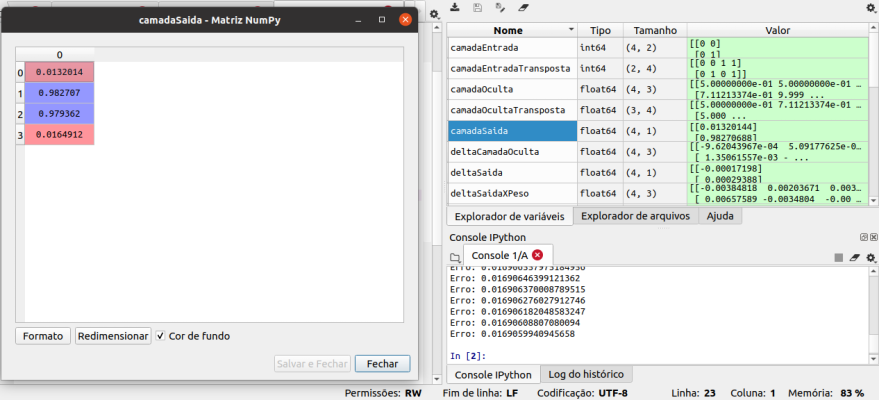

# and-or-xor-phyton-neuralnetwork
> tres codigos implementando uma rede neural que aprende and, or e xor

Codigos implementando uma rede neural, utilizando Python com a biblioteca Numpy.
Exemplos de redes para problemas lineares e nao lineares, para and e or, é utilizado apenas um "neuronio", enquanto para o xor é aplicada uma rede multicamada

## Instalação

All sistems:

Não é necessario instalar, apenas executar os arquivos em uma IDE Python, o algoritimo executara os passos e aprendera os valores para se chegar ao resultado.

## Exemplo de uso

Estes códigos demonstram passo a passo como funcina uma rede neural, pode-se fazer testes mudando a taxa de aprendizagem ou testando outros tipos de respostas desejadas.

## Meta

Cauê Rafael Burgardt – crburgardt@gmail.com

